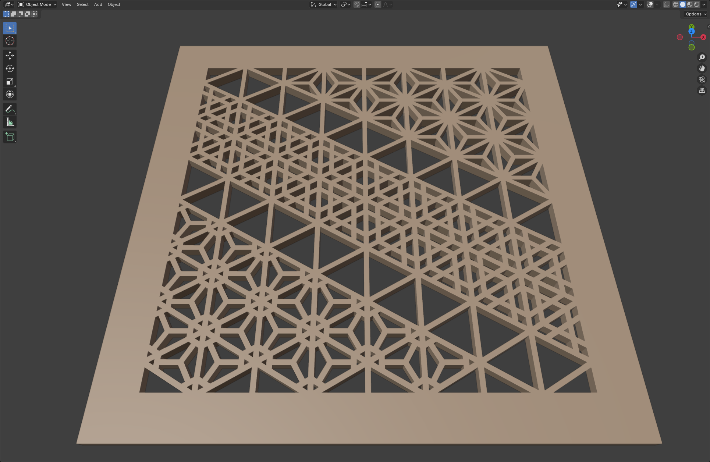

# KumikoPunch

A variable OpenType font for designing Kumiko panels or punching
Kumiko patterns into 3D models.

## Software support

| Status | Application | Comment
| ------ | ----------- | -------
| ✅ | Inkscape 1.4.2    |
| ✅ | Google Chrome 138 |
| ✅ | Photopea 5.6      |
| ⚠️ | Krita 5.2.9       | No variable font axis support, only named instances work.
| ⚠️ | Blender 4.4.3     | No variable font axis support, only default weight works. No Boolean operations on text objects, must be converted to meshes.
| ⚠️ | GIMP 3.0.4        | No variable font axis support, only named instances work. Line-spacing is moronic.
| ❌ | FreeCAD 1.0.1     | No multiline text support, no variable font support.
| ❌ | SolveSpace 3.1    | No multiline text support, no variable font support.
| ❌ | OpenSCAD 2021.01  | No multiline text support, no variable font support.
| ❌ | LibreCAD 2.2.1.1  | No OpenType font support.
| ❌ | Tinkercad         | No OpenType font support.
| ❌ | Dune 3D 1.3.0     | Font selector crashes.

**Legend:** ✅ Works - ⚠️ Partially works - ❌ Broken

## License

This font is licensed under the SIL Open Font License version 1.1 with
reserved font name "KumikoPunch".
